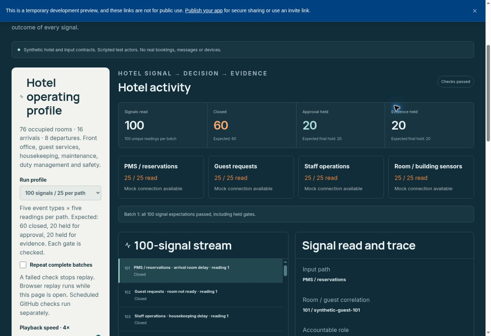

# JALDO Travel — critical review and partner demo sequence

Date: 6 October 2026 (Australia/Sydney). Baseline: main `cf79e82`.

## Outcome

The review found a concrete approval bypass in the shared reducer and a presentation gap between learning proposals and reviewed replay in the Architecture Lab. Both are corrected in this branch. The new Scenario Impact Map explains the breadth of impact, connects every canonical scenario to its definition/configuration/runtime and gives a specific design-partnership close.

The initial source review was followed by a live desktop browser pass using the working Replit Preview supplied on 6 October. PR #21 changes are visible in that Preview. The browser checks below cover the six Impact Map selectors, five Architecture Lab traces, a full hotel batch, the separate outcome profile and all 25 reference-navigation destinations. This remains synthetic proof, not a production audit. Category positioning (PR #22) and subsequent browser-found copy/navigation corrections require a Replit pull before their updated rendering can be verified.

## Findings and disposition

| Finding | Why it matters | Disposition |
|---|---|---|
| Room delay, backlog, maintenance and premium opportunity could transition from decision-required directly to in-action despite configured human approval | UI routing alone did not enforce the stated governance contract | Shared reducer now blocks the shortcut whenever the scenario requires approval. New regression tests failed on the original implementation and pass on the fix. Transport retains its explicitly permitted direct transition. |
| Architecture Lab ended after outcome verification and a learning proposal | Partners could not see review → replay → verification without changing screens | Added explicit approve/reject, reviewed replay, retained baseline/review IDs and adverse capacity challenge using the existing hotel learning driver. |
| Missing measurement was absent from the Architecture Lab selector | A pending outcome could be confused with a failed or successful action | Added missing-measurement fixture and correlated synthetic measurement reconciliation. Missing measurement cannot create an improvement claim. |
| Follow-up condition could change after observation | Displayed fault could disagree with the baseline used for replay | Freeze selection after observation; reset or scenario change clears review, replay and challenge state. |
| Only four Architecture Lab traces were exposed | Transport input-path coverage was not discoverable there | Added transport as the fifth trace. Premium opportunity remains a prototype exercised through configured runtime tests, not a hotel input adapter. |
| Breadth of impact was scattered across many pages | Partners could see a moment response without understanding its wider operating implications | Added Scenario Impact Map, with guest/team/property/planned portfolio impact, canonical policy/communication/escalation/evidence and pilot metrics. |
| Proof copy said there was no reliance on individual judgement and called every playbook tested | Contradicted human governance and overstated operational validation | Corrected both claims; revised “architecturally complete” and unsubstantiated “hundreds” wording in Overview. |
| Scenario detail selectors were click-only divs | Keyboard users could not reliably inspect canonical scenario details | Converted selectors to native buttons with selected-state announcements. |
| Architecture map had a fixed wide grid | Small screens could overflow | Added narrow-screen stacked map rows and a wrapped stage grid. CSS/build verified; browser layout verification remains outstanding. |
| Public demo unavailable at the known address | Blocks a credible partner handoff | Release blocker. Restore/confirm the current deployment and run the live checks below before presenting. |

## Scenario coverage

| Scenario | Canonical status | Default deployment | Four-path hotel adapter | Architecture Lab | New runtime audit |
|---|---|---|---|---|---|
| Repeat guest — room not ready | Working Proof | Active | Yes | Yes | Approval contract + normal + escalation + missing evidence |
| Distressed guest | Working Proof | Inactive | Yes, isolated mock configuration | Yes | Same matrix; welfare approval retained |
| Service backlog | Working Proof | Active | Yes | Yes | Same matrix |
| Maintenance defect | Working Proof | Active | Yes | Yes | Same matrix |
| Transport disruption | Working Proof | Inactive | Yes, isolated mock configuration | Yes | Same matrix; direct decision transition permitted by its canonical approval flag |
| Premium guest opportunity | Prototype | Inactive; Marketplace OS disabled | No | No | Same matrix in an explicitly activated synthetic test configuration |

The new audit deliberately activates all six scenarios and required operating systems in an isolated configuration. It does not change the default deployment or silently enable welfare, transport or Marketplace for a user.

The 100-read intake fixture has 25 readings per path (PMS, guest, staff, sensor). Its expected baseline is 60 closed, 20 held for approval and 20 held for evidence. Those expected holds are successful gate checks, not customer outcomes. The independent follow-up fixture expects 20 met, 40 not-met and 40 pending outcomes per 100 baseline journeys; its 60 approved correction replays pass the controlled normal fixture. Capacity challenges show that reviewed corrections can remain unsuccessful. All elapsed times, receipts, restoration observations and approvals are synthetic.

## What the loop means

1. Connect: validate the event contract, identity/correlation and source; reject malformed or conflicting input.
2. Understand: classify the moment and assemble scenario-specific context.
3. Decide: apply configured governance, permissions and accountable ownership; enforce required approval routing.
4. Act: model assignments and draft communication routing under explicit synthetic approval.
5. Learn: correlate the follow-up; preserve pending, late and ineffective outcomes rather than equating dispatch with resolution.
6. Review: expose the candidate adjustment and retain the designated scripted reviewer’s decision.
7. Replay: create a new synthetic execution linked to the original event and review; retain baseline evidence.
8. Verify again: test improvement and adverse capacity. Do not automatically promote a candidate to saved configuration.

The generic follow-up metric is restoration with a receipt within 20 minutes. It cannot substitute for welfare quality, loyalty retention, incremental margin, staff wellbeing or all scenario-specific outcome definitions. The impact map exposes those pilot measures separately.

## Partner walkthrough — approximately 25 minutes

| Time | Screen / action | What to establish | Question to invite |
|---|---|---|---|
| 0–2 min | Overview → Scenario Impact Map | Guests see one hotel; its response crosses teams and systems | Which recurring moment currently falls between your teams? |
| 2–5 min | Select room delay, backlog, maintenance, welfare, transport and premium opportunity | Show all six different owners, rules, evidence and impact paths; distinguish prototype and inactive configuration | Which three moments deserve your first pilot? |
| 5–10 min | Architecture Lab → room delay → validate → classify → governance → human approval → synthetic dispatch | Explain the existing systems, the coordination layer and human authority | Who would own this decision in your property? |
| 10–14 min | Choose late response before verifying → approve improvement → replay → enable capacity challenge → replay again | Baseline misses target; normal candidate passes; constrained replay can still fail | What operational capacity would make this correction ineffective? |
| 14–16 min | Reset → missing measurement → verify → supply correlated synthetic measurement | Missing evidence is pending; new evidence is correlated and earlier observation retained | What counts as independent evidence that your guest’s issue was resolved? |
| 16–19 min | Execution Centre / Simulation Lab → four paths and outcome journeys | Explain 100 unique readings, holds, rejection/recovery and separate outcome/replay evidence | Which input would be most reliable for your first property? |
| 19–22 min | Build & Configure → Integration → Proof Calculator | Map their systems/roles; make value assumptions inspectable | What baseline, costs and counterfactual would your CFO accept? |
| 22–25 min | Impact Map close → Next Step → design partnership | Agree one property, three recurring moments, accountable people and evidence plan | Can we scope those three moments with your operations and technology leads? |

Closing line: **Your next service failure can become your next operating improvement.**

The urgency is repeated operational friction and the opportunity to shape initial deployment standards. No invented scarcity, guaranteed ROI or live integration claim is used.

## Verification

- 644 Vitest tests pass across 24 files, including 39 new audit checks.
- All six canonical scenarios tested through normal, escalation and missing-evidence journeys with visitor approval holds.
- Five Architecture Lab traces tested through three corrections, rejection, approved normal replay and adverse capacity replay.
- Application TypeScript and simulation TypeScript checks pass.
- Production build passes; restricted-content bundle check passes.
- Access-boundary check passes: 62 approved routes, 97 reachable source modules.
- Internal-link check passes: 90 literal links; route import check passes.
- Terminology and local-asset checks pass.
- Eight cadence/sandbox-blocking checks pass.
- The hourly simulation command now includes the complete canonical scenario audit. This change becomes scheduled coverage only after it reaches main.

The existing build emits a large-entry-chunk warning and a tooltip sourcemap warning. Neither blocks the build; they are not evidence of browser responsiveness or performance. Current source routing inventory contains 53 page components; source/route checks cover these, but they do not substitute for clicking each page in the restored live site.

## Release checks still required

1. Merge/sync the branch, restore or identify the current Replit deployment and confirm the live version.
2. Desktop and narrow-screen inspection of the Impact Map, architecture layers, review controls and scenario selectors.
3. Live click-through of normal, rejected, approved, challenged and missing-measurement journeys; confirm scenario/reset clears old review state.
4. Confirm runtime readiness for inactive/default scenarios is clearly reported and Configure links resolve.
5. Check partner access behaviour and the approved proof boundary before external sharing.
6. Verify the first post-merge scheduled run includes the new scenario audit; inspect retained artifacts and gaps rather than treating the schedule itself as proof of execution.

Production qualification remains outside synthetic proof: vendor sandbox tests with authorised credentials, server-side authentication/authorisation, tenancy and durability, channel delivery, real task receipts and measured pilot outcomes. The current code gate explicitly states it is not a production security boundary.

## Live Preview verification — 6 October 2026

The supplied Preview rendered the merged Impact Map and reviewed replay. The former published-address blocker is resolved for this development Preview.

| Browser check | Observed result |
|---|---|
| Six Impact Map selections | Each switches to its canonical title, definition, configuration and runtime-readiness links |
| Five Architecture traces × normal response | All five: met and closed; no correction proposed |
| Five traces × late response | All five: not-met, closed, late-response correction available |
| Five traces × ineffective action | All five: not-met and in-action; intervention correction available |
| Five traces × missing receipt | All five: pending and in-action; receipt correction available |
| Five traces × missing measurement | All five: pending and in-action; no improvement claim; correlated recheck offered |
| Welfare measurement reconciliation | Pending becomes met and closed with supplied synthetic measurement |
| Room delay reviewed replay | Late baseline 30 minutes / not-met → approved replay 15 minutes / met |
| Room delay capacity challenge | Same reviewed change, insufficient capacity: 35 minutes / not-met |
| Transport rejected review | Review retained as rejected; no replay control offered |
| Full mock hotel batch | Checks passed: 100 read, 60 closed, 20 approval held, 20 evidence held; 25 per input path |
| Separate 100 outcome journeys | 20 met, 40 not-met, 40 pending |
| All 25 reference menu destinations | Rendered at 1348×927 desktop viewport; no page-wide overflow or broken main images detected |

The route evidence is retained in [travel-live-route-audit-2026-10-06.json](travel-live-route-audit-2026-10-06.json). The batch evidence is shown below.

### Additional corrections found in the browser

- Replace named hotel brands with five travel and hospitality categories. Include everyday accommodation, independent operators and large groups. PR #22 merged into main; QA, simulation and cadence observer passed.
- Landing links named Dual View, Moment Economy, Decision & Action, Signals Engine and Story Lab opened generic hubs. Point them to the matching existing views; identify playbook configuration and shadow pilot planning accurately.
- Decision Spine and Validation titles were generic divs. Use semantic h1 headings.
- Canonical moment text claimed AI classification with unqualified confidence percentages despite the deterministic demo. Label the classifier rules-based and the values illustrative.
- Landing copy claimed operation without manual oversight and deployment across all five environments. State accountable human oversight and planned expansion.
- Next Step repeated its Pilot Model footer link; Partner Ecosystem had two links to Next Step keyed by the same route, producing a React warning. Remove the redundant entries.

### Verification limits

This pass does not certify every control on every page, narrow-screen rendering, real integration delivery, production security, or measured operator value. The Preview's optional access gate was disabled in this session; source-level access checks remain separate. Premium opportunity has Impact Map and isolated runtime coverage but no hotel input adapter or Architecture Lab trace. Updated copy and heading/link fixes are source-verified until Replit pulls main. These distinctions prevent a synthetic success from being presented as a live customer outcome.
